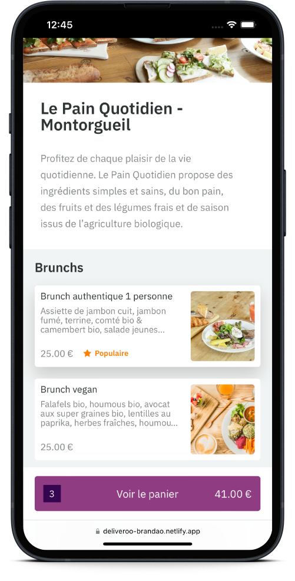
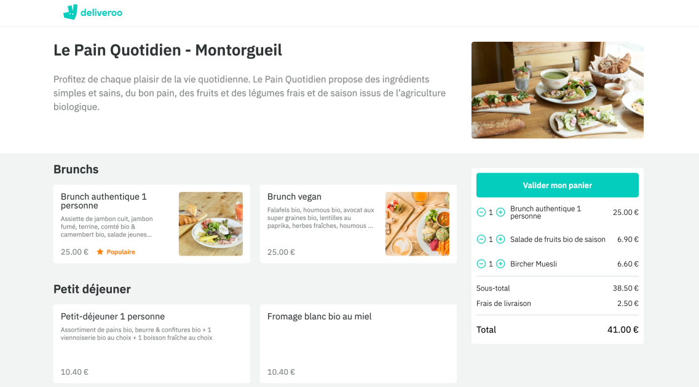

# Deliveroo React

Single deliveroo clone page of _Le Pain Quotidien_ restaurant with shopping cart interactivity

## Stack

  

## Features

- useEffect hook for fetching restaurant data
- useState hook for cart state management (adding / removing items, modifying quantity)
- fully responsive

---

#### Démo (Deployed on Netlify)

> https://deliveroo-brandao.netlify.app/

#### Back-end (Deployed on Railway)

> repository ➡️ https://github.com/Branda0/deliveroo-backend
